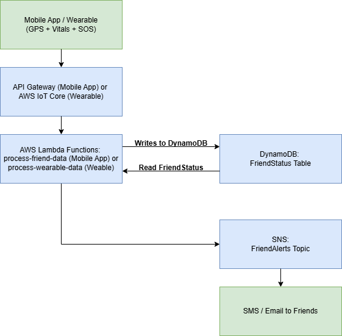

# PULSE

AWS Lambda Hackathon 2025 Submission  
GitHub Repo: 

## Demo Video
👉 [YouTube Link to Demo Video](https://your-demo-link.com)

## Project Overview

PULSE is a real-time Friend Group Safety Monitor designed for nights out and events.  
Friends can stay connected via the app — sharing:

- Location (GPS)
- Vitals data (heart rate, stress level)
- SOS button alerts

If a friend strays too far from the group, shows abnormal vitals, or presses SOS,  
AWS Lambda functions immediately send alerts to all friends via SMS/email.

## Architecture Diagram

## AWS Tools Used
